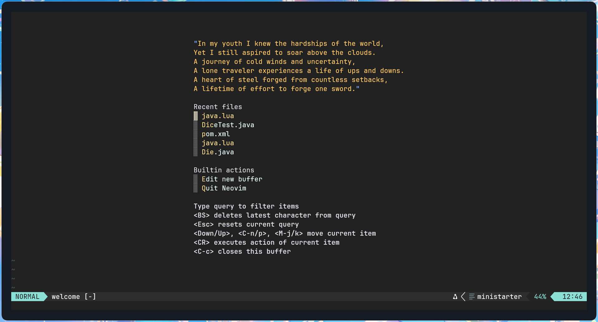

# bubble-gum.nvim

This is a personal Neovim config with bubblegums tones.
It includes the following basic utilities:
- Telescope
- Tree-sitter
- LSP
- Oil (file navigation, no neo-tree btw)
- Conform (formatting)
- Gitsigns (git blame/diff)
- Which-key (keymap discoverability)
- Neotest (test runner)
- Tmux-synced colors
  
Please note that this config is highly opinionated and might not suit everyone.

